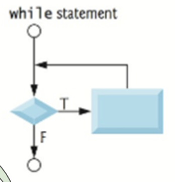
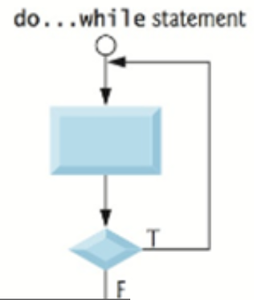
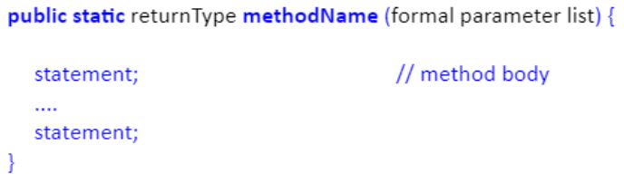
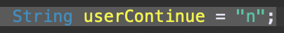
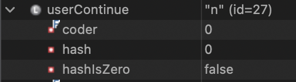
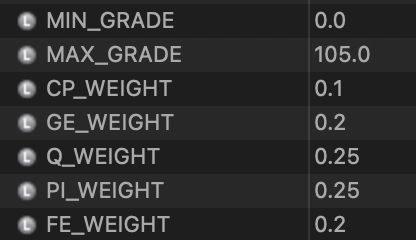
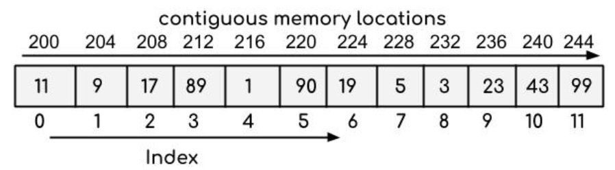
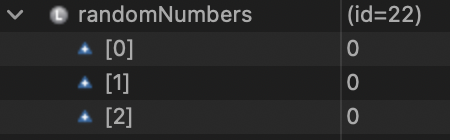
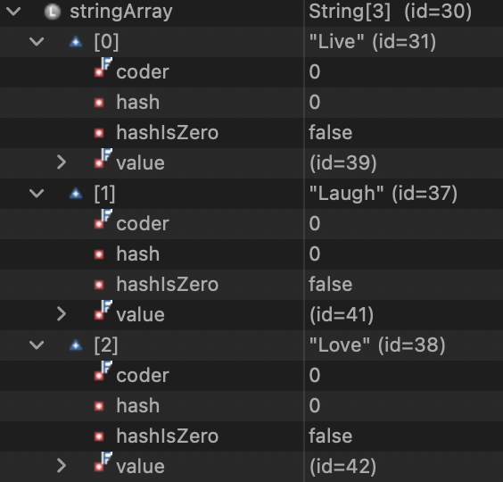

# Technical Documentation CS1050 #

**Table Of Contents**
- [Module 01](#module-01-programming-fundamentals-and-java)
- [Module 02](#module-02-predefined-classes-methods-and-decision-structures)
- [Module 03](#module-03-loops-and-software-development)
- [Module 04](#module-04-arrays-and-files)
- [Quick References](#quick-references)

## Module 01: Programming Fundamentals and Java ##

- [Naming Conventions](#naming-conventions)
- [Types of Errors](#types-of-errors)
    - [Syntax Errors](#syntax-errors)
    - [Runtime Errors](#runtime-errors)
    - [Logic Errors](#logic-errors)
- [Primitive Data Types](#primitive-data-types)
    - [Implicit vs Explicit Casting](#implicit-vs-explicit-casting)
- [How does division work?](#how-does-division-work)
- [What is hard coding?](#what-is-hard-coding-and-why-is-it-bad)

### Naming Conventions ###

These are a set of rules that each type of programming language has (ex: java, python, css) to help make code more **readable**.

Readability in code is paramount because it allows you to *quickly* and *easily* identify what is going on. Using standard naming convenetions for ***whatever*** language you are working in helps make your code a) editable and b) scalable. Even after you have left the project. It allows others to come behind you and work within the program you wrote.

There are a few types of naming conventions discussed in this module

1. Variables
    - The first word is lowercase then the rest are uppercase
    - <ins>**b**</ins>right<ins>**S**</ins>un<ins>**F**</ins>lower
2. Constants
    - All caps, with underscores to separate words
    - LIVE_LAUGH_LOVE
3. Classes
    - Capitalize the beginning of each word
    - <ins>**B**</ins>est<ins>**E**</ins>xample<ins>**E**</ins>ver
4. Methods
    - All lower case, but will be clearly separate so it won't be confusing
5. Data Types
    - All lower case
    - `double; int; string`

### Types of Errors ###

There are several types of errors that you may come across as you code. They can generally be categorized into the below categories.

#### Syntax Errors ####

This type of error occurs when you **violate** the syntax of the code. Kind of self explanatory right? This can happen whenever you don't put on a semicolon `;` at the end of a line of code.

[comment]: # (Insert picture of syntax error due to ;)

This will be detected by the compiler, so your code won't actually run.

#### Runtime Errors ####

These error types aren't caught by the initial compiling, and instead happens whenever the code is actually running.

An ***error*** message will display in the console as a result.

[comment]: # (Insert picture of error message in console)

This is caused by something being off *within* your code that the computer can't understand. For example, dividing something by a `0`. This is not technically possible, and the computer will go wtf and throw it back at you.

#### Logic Errors ####

Logic errors are another way of saying **user error** essentially.  
You designed your algorithm wrong somewhere and now your code is going off the rails doing stuff that you aren't anticipating.   

`It's become sentient.`

Scary stuff for sure. Apocalyptic scene where computers are taking over the world. 

Anyways this can be something as simple as your program getting stuck in a loop forever whenever it was supposed to exit eventually.

Another example that we've used in class can be with the assigning letter grades based on your final grade result.

```javascript
if (finalGrade => 90)
    {
        System.out.println ("A");
    }

if (finalGrade => 80)
    {
        System.out.println ("B");
    }
```

In the above example, what I'm trying to do is have the program display **1** output, either A or B. What actually will happen is if the `finalGrade` is over 80, then it will display as ***both*** A **and** B.

In this case, a more appropriate code would be as follows...

```javascript

double finalGrade = 85

if (finalGrade => 90)
    {
        System.out.println ("A");
    }
if else (finalGrade => 80)
    {
        System.out.println ("B");
    }
```

Because the program will check each case until it finds one that is true, it won't give multiple outputs. This is called a [multi-way if](#multi-way-if-statments).

### Primitive Data Types ###

These are data types that can only hold **one** value at a time. 

In order from smallest to largest for numbers;

1. Byte
2. Short
3. Int
4. Long
5. Float
6. Double

However, in this class we're mainly going to be using `int` and `double`. These are relatively simple yet extremely versatile.

`int` can only hold **whole** numbers.   
25, 348, 1268308

`double` can hold whole numbers **including** decimals.  
85.3, 0.943, 1000.987

There is also `boolean`'s and `char`'s  
A boolean holds a true/false value  
Char holds a single character

#### Implicit vs Explicit Casting ####

**<ins> Implicit Casting </ins>**  
This is moving smaller data types into a **larger** bucket. This does **not** need to be specifically coded. Because there is still "room" for the smaller data type to be in the larger bucket without overflowing.

```java
    int DOG_AGE = 5

    double humanAge = (DOG_AGE)(5)
```

**<ins> Explicit Casting </ins>**  
This is moving a larger data type into a **smaller** bucket. You have to *explicitly* (cute right?) state that you're wanting to cast this into a smaller bucket. This essentially compresses the value to fit into the smaller bucket.

```java
    double QUIZ_AVERAGE = 79

    int finalGrade = (int)(QUIZ_AVERAGE)(0.20)
```

### How does Division work?

How the program executes division has everything to do with what **data type** you are using. 

`1/2` will output `0`  
That's weird? Why would it do that? It's because you used two values that were `int`. The result of this operation is technically a double, because it is `0.5`.

You have to *explicitly* state what type of output you want if it is something other than what is being used initially. 

`(double)(1/2)` will output `0.5`

### What is **hard coding** and why is it bad?

Hardcoding is when you put in a value into the code itself instead of assigning a constant to use for it. This makes your code not only more readable, but also more adaptable. Instead of having to go through and change each instance of the constant number being used, you just have to change it once.

## Module 02: Predefined Classes, Methods, and Decision Structures ##

- [Packages](#packages)
- [Classes](#classes)
    - [Creating an Object](#creating-an-object-from-a-class)
- [Methods](#methods)
    - [Method Overloading](#method-overloading)
- [Math Class](#math-class)
- [Random Number Generator](#create-random-integers)
- [Chars](#chars)
- [Strings](#strings)
    - [Trim White Space](#trim-white-space-from-strings)
    - [Booleans in Strings](#using-boolean-values-in-strings)
- [Booleans](#booleans)
    - [Relational Operators](#relational-operators)
- [If/Else Commands](#ifelse-commands)
- [Nested Ifs](#nested-if-statements)
- [Multi-Way Ifs](#multi-way-if-statments)
- [Switch Statements](#switch-statements)

### Packages ###

Packages are essentially an umbrella term for classes that share similar functions and characteristics.

- Prevent naming conflicts by allowing classes with the same name to exist in different packages, like **college.staff.cse.Employee** and **college.staff.ee.Employee**
-  They make it easier to organize, locate, and use classes, interfaces, and other components.

You may have to import packages/classes sometimes. For example, to use the **Scanner** class, you must put the following *before* you implement the main method.

```java
import java.util.Scanner
```

The **java.util** is the package, and the Scanner is the specific class that you are calling.

### Classes ###

Every Java program must have a **class**. This is like a set of blueprints that you can call from to execute specific functions. 

For example the *Math* class has useful methods within it that relate to mathematical computation.

Once you import the desired class, you can then use **methods** within that class to create objects to utilize within your code.

#### Creating an Object from a Class ####

To use imported classes, you must first create an object that utilizes the blueprint of them. 

```java
Point originOne = new Point(23, 94);
Rectangle rectOne = new Rectangle(originOne, 100, 200);
Rectangle rectTwo = new Rectangle(50, 100);
```

`Point` is a class, `originOne` is the object name, and `new Point(23,94);` is giving instructions from the point class to the new object.

There are some classes that you do not have to create objects from before utilizing them. An example of this would be the Math or System class. At any point within the program you can call on these classes without having to create an object first.

### Methods ###

Methods are essentially blueprints within a class. They have formal parameters that dictate what they are able to execute. These formal parameters are then passed onto the actual parameters once a value has been assigned.

Some classes/methods are **already** imported into java by default. For example, you do not need to explicitly import the `Math` class or the `System` class in order to utilize methods from them. These are baked into the `java.lang` and that is a package that is *auto imported*.


In Eclipse, you can type in the **class** name follwed by a period and it will pull up every method that you can call from that class as well as descriptions on what each method does.

#### Method Overloading ####

There are some instances where a class may have methods with the *same* name but **different parameters**.

This is like when `println` can be used for `int`, `char`, **and** `string`. All of these data types require different amounts of storage amounts, but you can specify which type you want within the IDE.


This overall increases the readability of the program which helps developers who come after you make informed choices when they are changing things. Much easier to know that any time it says `println` you know something is being put out to the console.

### Math Class ###

The Math class is an already imported class and does not need new objects created in order to use it.

These types of methods are called *static methods* 

- Allow you to call them without creating an object first
- Because of this are NOT associated with a specific object
- To call static methods you use the `ClassName.methodname`

Here is an example of what <ins>**not**</ins> to do

```java
Math myMath = new Math()
```

You can just call on the Math class whenever you need it. In fact, if you try and create an object from Math, you will get a compiler error.

```java
int number = (int) Math.random()
```

As you can see, we used the method `random` without have to instantiate an object from it first. The parenthesis ( ) after the method illustrates that it will hold a value in the **future**. In this instance the random method generates a pseudo-random number, which would then be held in the open parenthesis.

#### Why all the fuss? ####

The reason that these methods exist is to have an easy way to execute complex tasks. I don't need to re-invent the wheel so to speak. I don't **need** to know how the `Math.random` method works under the hood, I just need it to work.

### Create Random Integers ###

The multiplier that you put with the `Math.random` operation will be the range that it can go through.

```java
randomMonth = (int) (Math.random()*12)
```

In the above example, there are 12 months in a year so that is the range that we want it to be.

### Chars ###

Chars are single pieces of information that "under the hood" connect to ASCII values that are stored and then represented.

Because they are connected to ASCII numbers, you can cast `char` values into numeric form. If the data type is smaller than the char, the char is "cut off" at the largest bit that it can hold.


Important thing to note: When storing chars you have to use single quotes **(``)**.

### Strings ###

Strings are essentially [arrays](#what-is-an-array) that hold multiple char values. This is a non-primitive data type because it holds **multiple values**. 

This is the way that we declare Strings in this course.

```java
String firstName = ("Raina")
```

Below are errors that can occur if you make a couple different types of mistakes.


#### Trim White Space from Strings ####

Sometimes you need to get ride of extra fluff that a user might add on accident. This is where the method `trim` can come in handy. It will eliminate the white space before and after the first/last chars and leave the white space between them alone.

```java
String messy = "   Long string with white spaces    ";
System.out.println(messy.trim());

Displays:
Long string with white spaces
```

#### Using Boolean Values in Strings ####

You would think using the equality operator (==) with strings is how you compare two strings but if you use the equality operator to compare two strings, it is not doing what you think all the time.

Instead use methods to compare strings.

```java
userContinue.equals("y")
```

### Booleans ###

Booleans are a primitive data type that can only hold true or false. They are used with loops to decide whether the code will go into the loop or not.

#### Relational Operators ####

These are used to help the boolean decide if something is indeed true or false.

| Java | Math | Example R = 5 | Result |
|------|------|---------------|--------|
| <    | <    | R < 0         | false  |
| <=   | ≤    | R <= 0        | false  |
| >    | >    | R > 0         | true   |
| >=   | ≥    | R >= 0        | true   |
| ==   | =    | R == 0        | false  |
| !=   | ≠    | R != 0        | true   |

You can also use these in conjunction with the following operators when there are two conditions that you are checking for.

| Java | Eng | Example R = 5, S = 1 | Result |
|------|-----|----------------------|--------|
| &&   | And |  R < 0 && S > 0      | false  |
| l l  | Or  |  R < 0 l l S > 0     | true   |
| !    | Not |  !R < 0 && S > 0     | true   |

The `!` is a modifier by reversing the logical value of the expression.

### If/Else Commands ###

If/else statements are used when we are deciding what course of action to take based on whether the condition is true or not.

You can use if statements just on their own, because if it does not match the boolean it will simply exit.

But if you want to direct the code to do a specific thing if the boolean is false, you need to follow it up with an else statement.

```java
if (grade < 60)
{
    System.out.println("Come to office hours")
}
else
{
    System.out.println("Passed")
}
```

You have to be careful on where you are placing your declarations and initializations of variables. There is the practice of **least privileged** access. So if a variable is only needed in one section of the code, then it should only be within the [*scope*](#scope) of that section.

You can easily tell the **scope** of something by looking at where the curly brackets { } start and end. 

```java
if (number1 < number 2)
{
    int temp = number1;
    number1 = number2;
    number2 = temp;
    System.out.println("Temp value is " + temp)
}
    System.out.println("Temp value is " + temp)
```

The second println is trying to call on a variable that is **only** available inside the if statement. This is to promote security and readability. Imagine trying to figure out where the temp variable is and it's in some random if command.

Make sure to pay attention to where you are putting your curly braces `{ }` and your semicolons `;`. If you put these in the wrong spots it causes logic errors because the program cannot read your code in the order that it is intended.

### Nested If Statements ###

If there are a series of conditions that are based on previous inputs then you would use a nested if. It is called nested because it can lead to other if/else statements within the same overall block.

```java
System.out.println("Let's play 20 questions. Choose an animal and I will try to guess it!");
    Scanner scan = new Scanner(System.in);
  
    System.out.println("Is it a mammal (y/n)?");
    String answer = scan.nextLine();
    if (answer.equals("y")) 
    {
      System.out.println("Is it a pet (y/n)?");
      answer = scan.nextLine();
      
      if (answer.equals("y")) 
      {
           System.out.println("I guess a dog!");
      }
      else 
      { 
         System.out.println("I guess an elephant!");   
      }
    }      
    else 
    { // not a mammal  
        System.out.println("I guess a bird!");
    }
```

### Multi-Way If Statments ###

If there is more than **one** output based on the input then you use mulit-way ifs. The nice thing about these if that the program will follow sequentially down until it finds something that is true and then it will *exit*. They are easy to spot because instead of just having `if` or `else` it will have `else if`.

```java
if (grade >= 90)
{
    System.out.println("You got an A");
}
else if (grade >= 80)
{
    System.out.println("You got a B");
}
else if (grade >= 70)
{
    System.out.println("You got a C");
}
else
{
    System.out.println("Take the class again");
}
```

At the bottom you'll notice that instead of using another `else if` I used simply `else`. This is because I want **all** other conditions to fall into this else statement.

### Switch Statements ###

Switch statements are used only when you are getting **exact** values. This is also the only place that you will use `break`.

```java
int numDay=6;
		
        switch (numDay){
	        case 1 :{ 
	           System.out.println("Yeah! we have Java class on Monday."); 
	           break;
	        } 
	        case 2 :{
	           System.out.println("Its Tuesday and one more day until Java class again."); 
	           break;
	        } 
	        case 3 :{ 
	           System.out.println("Its Wednesday and time for Java."); 
	           break;
	        }     
	        case 4 :{ 
	           System.out.println("Its Thursday and I miss Java class.");
	           break; 
	        }     
	        case 5 :{ 
	           System.out.println("TGIF, but I will work on some Java.");
	           break;
	        }       
	        case 6 :
	        case 7 :{ 
	            System.out.println("Hurray, Its the weekend! Write Java code."); 
	            break;
	         }        	 
	        default :{
	                System.out.println("Wrong entry!");
	        }
       }//end switch
```

After each **case** there is a `break`. You'll notice that some cases don't have any information in them. This is because the action taken by the computer is the *same* as the one below and thus it falls through.

In this example `case 6` and `case 7` share the same output.

## Module 03: Loops and Software Development ##

- [Increment & Decrement](#increment-and-decrement)
- [While Loops](#while-loops)
    - [While Loop Design](#while-loop-design)
- [Do-While Loops](#do-while-loop)
- [For Loops](#for-loop)
- [Bad Loop Habits](#bad-ways-to-end-loops)
- [Scope](#scope)
- [Nested Loops](#nested-loops)
- [Creating Methods](#methods-2-electric-boogaloo)
- [Call and Stack Frames](#call-and-stack-frames)

### Increment and Decrement ###

There can be use cases where you want to maintain some sort of counter as you work through a loop. An example of this would be in summing a set of numbers.

The characters you would use is `i++` or `i--`. These both move by one in either direction. Instead of `i`, you would put the name of the variable that you are incrementing/decrementing.

```java
int max = 5;
sum = 0;
int count = 0;
		
	for (int num = 0; num <= max; num++)
		{sum = num + sum;
		System.out.println(sum);
		}
```

### While Loops ###

These are used to check if a *boolean* expression is true or false. If it is true, then it enters into the body of while.



In the example below, we are utilizing our logic operators. In the while loop **parameters** it is saying while number1 + number2 does **not** equal answer. This is where these [boolean](#relational-operators) expressions are very helpful.

```java 
 int number1 = (int)(Math.random() * 10);
    int number2 = (int)(Math.random() * 10);

    // Create a Scanner
    Scanner input = new Scanner(System.in);

    System.out.print(
      "What is " + number1 + " + " + number2 + "? ");
    int answer = input.nextInt();
    
    while (number1 + number2 != answer) {
      System.out.print("Wrong answer. Try again. What is " 
        + number1 + " + " + number2 + "? ");
      answer = input.nextInt();
    }

    System.out.println("You got it!");
```

While loops **MUST** contain statement to change loop control. Otherwise you will create an infinite loop which is not what you ever want to do.

#### While Loop Design ###

1. Figure out what part of your code needs to be repeated
2. Place that part of your code into a loop
3. Determine what condition the loop checks
4. Make sure you have code in the body that eventually causes the condition to become false

<ins>While loop:</ins>
Condition is checked **before** the loop body is executed
    
<ins>Do - while loop:</ins> condition is checked **after** the loop body is executed

### Sentinel Values ###

These are values that can change the condition of a loop based on a *users* input.

```java
 int sum = 0;
    while (data != 0) {
        sum += data;

        // Read the next data
        System.out.print("Enter an integer (the input ends if it is 0): ");
        data = input.nextInt();
    }
```

This gives the user an option on whether or not to repeat the loop.

### Do-While Loop

This loop functions the same as a while loop, but it will execute **at least** once. While loops have the ability to be bypassed whereas do while *has* to execute at least once. 



```java
//Initializes the loop control variable
int counter = 1; 

System.out.printf("Count before loop starts is %d ",counter);

//do while loop will execute once then check condition 
do 
{	
	//Changes the loop control variable
	counter++;	
	System.out.printf("Count is %d \n",counter);
				
} while (counter <= 5); //checks condition
```

For most loops a semicolon `;` is a death sentence. But for do while's you **need** the `;`.

### For Loop ###

This is similar to the while loop, but it is used when you know the amount of times that the loop needs to execute.

```java
for (int i = 0; i <= 2; i++) 
{
   System.out.println("This is iteration " + i + " of the for-loop");
}
```

The above code is initializing the variable, setting a boolean expression, and setting an increment. This can be used for counters.

### Bad Ways to end Loops ###

Using `system.exit`
- Prevents final cleanup code from running, meaning any necessary post-loop logic never executes.
- Does not allow for proper error handling or expansion, making the code harder to maintain.

Using `break`
- Breaks loop flow early instead of using a clear loop condition.
- Makes the logic harder to follow.
- Only place where you use `break` is in switch statements

### Scope ###

This is the area of a program that a variable can be referenced.

For example: Declaring the control variable `j` in the for-loop causes its scope to be only inside the loop

Whilst Declaring control variable `j`  before the for loop cause its scope to be inside and outside the loop 

### Nested Loops ###

You can put while loops in for loops or for loops in while loops. Loops can be in if/else conditions and if/else conditions can be in loops.

To summarize, you can place any type of loop **inside** another loop.

It's *loop-ception*

```java
int outer = 1;
while (outer < 3) {
System.out.println ("The outer loop iteration is = " + outer);
			
	 // This is the inner while loop
	 // It will do all iterations before outer loop does another iteration
	   
	 int inner = 1;			
	 while (inner <= 5) {
	      System.out.println ("   The inner loop iteration is = " + inner);
		inner++;
	  }
			
	 outer++;
}
```

This is interesting because the inner loop will **completely** iterate through *before* kicking back into the outer loop. So the console output looks like below...

```java
The outer loop iteration is = 1
    The inner loop iteration is = 1
    The inner loop iteration is = 2
    The inner loop iteration is = 3
    The inner loop iteration is = 4
    The inner loop iteration is = 5
The outer loop iteration is = 2
    The inner loop iteration is = 1
    The inner loop iteration is = 2
    The inner loop iteration is = 3
    The inner loop iteration is = 4
    The inner loop iteration is = 5
```

### Methods 2: Electric Boogaloo ###

What is the purpose of creating our own methods?

- Provides a way to organize and simplify code
- Once code is in a method it can be called many times so do not repeat code
- Improves code quality and readability
- Breaking code into units makes it easier to plan, code, test and modify

General Form/Function

- public - visible to all classes
- static - static methods belong to a class
- returnType - data type for value that is returned (int, double, boolean, etc.) or void (nothing to return)
- methodName - a user defined name
- formal parameter list - information that is coming into the method



When you are calling a method into main, you **must** put parenthesis `()` where you put the values to pass into the method. In this case, the values of `i` and `j` are being [*passed by value*](#pass-by-value) into the variables `num1` and `num2` inside of the `max` method.

```java
public static void main(String[] args) {
    int i = 5;
    int j = 2;
    int k = max(i, j); // Invoke max method
    System.out.println("The maximum between " + i +
      " and " + j + " is " + k);
  }

  /** Return the max between two numbers */
  public static int max(int num1, int num2) {
    int result;

    if (num1 > num2)
      result = num1;
    else
      result = num2;

    return result; // Return result
  }
```

You could also tehcnically **hard code** into the arguements when you invoke the method. In this case, you could have done `int k = max(5,2);`.

This is functionally the same thing. But, as discussed [earlier](#what-is-hard-coding-and-why-is-it-bad) we do want to avoid hardcoding when possible. This is why we have variables that hold the values so that it can stay consistent across the code.

<ins>**An important thing to note!**</ins>

When you are defining the *formal parameter* list, you are essentially creating variables that live **only** inside the method that you are creating. If you want a variable to be accessible across all methods, then you must declare/initialize it within `main`.

```java
public static double getValidGrade (double MIN_GRADE, double MAX_GRADE, Scanner input) {
		
		// ensuring that to start the grade is not within range
		double grade = -1;
		
		while (grade < MIN_GRADE || grade > MAX_GRADE)
		{
			grade = input.nextDouble();
			
			//error message to display if outside of range
			if (grade < MIN_GRADE || grade > MAX_GRADE)
			{
				System.out.println("Please input a grade between " + MIN_GRADE + "and " + MAX_GRADE);
			}
		}
		return grade;
	}
```

In the above case, we defined a `double` as what the **return** will be. If you create a method that has a return to main, at the end of the method you must **explicitly** state what you are returning to main. If you do not, you will get the below error code.


As standard practice, you only want to return `one` value back to main. Notice in the code below even though there are multiple *possible* outcomes, we are **only** returning `one` back to main.

```java
public static char determineLetterGrade(double finalGrade)
	{
		char letterGrade = ' ';
			
		if (finalGrade >= 90)
		{
			letterGrade =  'A';
		}
		else if (finalGrade >= 80)
		{
			letterGrade = 'B';
		} 
		else if (finalGrade >= 70)
		{
			letterGrade = 'C';
		} 
		else if (finalGrade >= 60)
		{
			letterGrade = 'D';
		} 
		else
		{
			letterGrade = 'F';
		}
		return letterGrade;
	}
```

### Call and Stack Frames ###
 
AKA the "push and pop"

Stacks are last in, first out (LIFO) last item pushed onto stack is 1st item popped off.

The **call stack** is used to keep track of active methods. When method is called, information for that method (called a stack frame) is *pushed* onto the stack.

Information that is pushed
- Values of parameters and local variables
- Current line of code executing
- Return address to return to calling function

Method on the top of stack is the current executing method.
Method stays on top until the ending curly brace is reached

When the Method returns (completes)
- Information for that method is popped off the stack
- Memory local to that stack is deallocated

Main is always going to be at the base of your stack. As main invokes methods, they are temporarily added onto the call stack until it is done executing and then the **pop** off.


Methods other than main can also invoke methods themselves. That's why the stack doesn't only consist of two stacks at any one time, it can have methods within methods with methods.

### Pass by Value ###

Pass by value means putting a copy of the value from one memory location and puting it in another memory location. Even if you would make the formal parameter names the same they are still located in two different memory locations. 

A note on that: It creates more readable code if you name your variables **different** things, even if they are representing the same thing.

So when the method stack is building, for **primitive data types only** you are creating copies that only exist within each individual method's stack.

## Module 04: Arrays and Files ##

- [What is an Array?](#what-is-an-array)
    - [How is Data Accessed?](#how-is-data-in-arrays-accessed)
    - [What is an Array Index?](#what-is-an-array-index)
- [Declaring & Initializing Arrays](#declaring-and-initializing-arrays)
- [Putting Values into Arrays](#putting-values-into-arrays)
- [Array-Ception (Strings)](#array-ception)
- [Array-Ception (2D Arrays)](#array-ception-continued-2-d-arrays)

### The Heap vs Stack ###

So we've previously discussed the [memory stack](#call-and-stack-frames), but now we are going to talk about a different kind of memory storage called the **heap**. 

The heap is often visualized as a pile of shit that you can both add to and take away from. The data that is stored on the heap is accessed by *reference variables*. In our actual code, we may have a `String` for example. But under the hood we actual have an address that this variable name is pointing to on the heap.





Since a `String` is actually just an array of `chars`, userContinue is actually just holding the address that points to that array on the heap.

The benefit of utilizing heap memory is that it persists past the method stack frame. Meaning, if a method initilizes an array, when that method pops the array data is still stored on the heap itself. As long as we return the reference variable which holds the address back to main we can still access this data.

Primitive data types is what is stored within the stack frame. You can distinguish between what is stored on the stack vs the heap by looking at the debugger. In the above example, you can see a drop down arrow and instead of a value it has `(id=27)`.



Now in this example you can see the actual values being stored and there is no option for a drop down. This is being stored within the stack and **not** on the heap.

### Pass by Reference ###

When we are passing arrays down to other methods we are passing by reference. Because arrays are stored off the stack and on the heap, we simply are giving the method the **address** for the array we want it to have access to. This is more efficient for passing arrays because there is no need to create an entirely new memory section for this particular method when it still accessible on the heap.

### What is an Array? ###

An array is a type of data structure that hold values of the **same** data type in a sequential order on the **heap**

What is the heap? It's a place where data is stored *outside* of the stack frame that methods are placed housed in. So we put data on the heap that we want to persist past the life of a method.

Items that are stored on the heap have an **address** within the program itself. So we are not storing the actual data on the stack, just an address that points to the stack.

#### How is Data in Arrays Accessed? ###

It's actually pretty interesting how arrays work. So say we have `id=52`. The program goes to address `52` on the heap, then multiplies the amount of space allocation for a particular data type in order to go to the desired destination. So if I want to go to **index** 3, the computer goes to `52` and multiplies the data type memory by 3, and then can go to index 3. 

#### What is an Array Index? ####

It is the position slot in the array. And interesting thing to note is that arrays start at `index 0` becuase of how it retrieves data as discussed earlier.



### Declaring and Initializing Arrays ###

You must declare the data type and the *size* of the array before you can actually put data into it. When you are declaring the size you are putting the **total** number of spaces. But remember, all arrays start at index 0.

```java
int[] numbers = new int[5];
```

Instead of hardcoding like in the example above, it is standard practice to use variables for your array sizes.

```java
final int TOTAL_NUMBERS = 5

int[] numbers = new int[TOTAL_NUMBERS];
```

Once you declare the length of an array you **cannot** change it later in the program. You can type `array.length` to get the length of the array. Pretty self explanatory but really powerful when iterating through an array.

### Putting values into Arrays ###

There is several ways that you can put values into your array. Some of them are better than others, and some are only applicable in certain circumstances.

**<ins>You can initialize by hardcoding</ins>**

```java
/// Manually initialize array
int[] numberList = new int[5];
numberList[0] = 1;
numberList[1] = 2;
numberList[2] = 3;
numberList[3] = 4;
numberList[4] = 5;
```

**<ins>You can hardcode your values in a list </ins>**

```java
/// Initialize with a list
int[] numberList = {1, 2, 3, 4, 5};
```

**<ins>You can use a *for* loop to iterate through</ins>**

```java
int[] newArray = new int[arraySize];
	for (int i = 0; i < newArray.length; i++) {	
		newArray[i] = (int)(Math.random() * 10 + 1); 
		}
```

Whenever you put data into the array it will appear in memory on the heap.



### Array-Ception??? ###

What if we want an array of `Strings`? Those aren't a primitive data type, as we discussed earlier they are an array themselves.

Well, good news! You can store an array **of** arrays!



### Array-Ception Continued: 2-D Arrays ###

2-D arrays are essentially like a table that you may find in excel or any part of your day to day life.

You initialize them very similarly, but you put a second set of brackets to indicate the two dimensional nature of this array.

```java
int[][] newArray = new int[5][5];
```

## Quick References ##

### Eclipse Environment Set Up ###

[Click here](Environment%20Setup%20Eclipse,%20Git%20and%20Github.docx.pdf)

### Reading from the users keyboard ###

```java
Scanner input = Scanner new Scanner(System.in)

double classParticipation = input.nextDouble();
```
