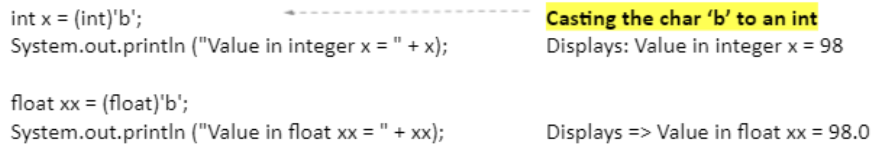
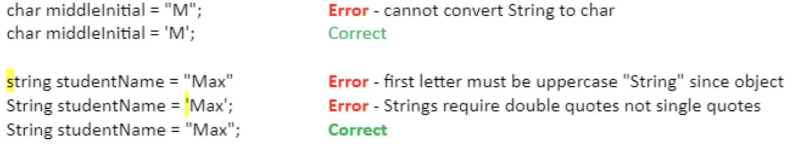

# Technical Documentation CS1050 #

**Table Of Contents**
- [Module 01](#module-01-programming-fundamentals-and-java)
- [Module 02](#module-02-predefined-classes-methods-and-decision-structures)
- [Quick References](#quick-references)

## Module 01: Programming Fundamentals and Java ##

- [Naming Conventions](#naming-conventions)
- [Types of Errors](#types-of-errors)
    - [Syntax Errors](#syntax-errors)
    - [Runtime Errors](#runtime-errors)
    - [Logic Errors](#logic-errors)
- [Primitive Data Types](#primitive-data-types)
    - [Implicit vs Explicit Casting](#implicit-vs-explicit-casting)
- [How does division work?](#how-does-division-work)
- [What is hard coding?](#what-is-hard-coding-and-why-is-it-bad)

### Naming Conventions ###

These are a set of rules that each type of programming language has (ex: java, python, css) to help make code more **readable**.

Readability in code is paramount because it allows you to *quickly* and *easily* identify what is going on. Using standard naming convenetions for ***whatever*** language you are working in helps make your code a) editable and b) scalable. Even after you have left the project. It allows others to come behind you and work within the program you wrote.

There are a few types of naming conventions discussed in this module

1. Variables
    - The first word is lowercase then the rest are uppercase
    - <ins>**b**</ins>right<ins>**S**</ins>un<ins>**F**</ins>lower
2. Constants
    - All caps, with underscores to separate words
    - LIVE_LAUGH_LOVE
3. Classes
    - Capitalize the beginning of each word
    - <ins>**B**</ins>est<ins>**E**</ins>xample<ins>**E**</ins>ver
4. Methods
    - All lower case, but will be clearly separate so it won't be confusing
5. Data Types
    - All lower case
    - `double; int; string`

### Types of Errors ###

There are several types of errors that you may come across as you code. They can generally be categorized into the below categories.

#### Syntax Errors ####

This type of error occurs when you **violate** the syntax of the code. Kind of self explanatory right? This can happen whenever you don't put on a semicolon `;` at the end of a line of code.

[comment]: # (Insert picture of syntax error due to ;)

This will be detected by the compiler, so your code won't actually run.

#### Runtime Errors ####

These error types aren't caught by the initial compiling, and instead happens whenever the code is actually running.

An ***error*** message will display in the console as a result.

[comment]: # (Insert picture of error message in console)

This is caused by something being off *within* your code that the computer can't understand. For example, dividing something by a `0`. This is not technically possible, and the computer will go wtf and throw it back at you.

#### Logic Errors ####

Logic errors are another way of saying **user error** essentially.  
You designed your algorithm wrong somewhere and now your code is going off the rails doing stuff that you aren't anticipating.   

`It's become sentient.`

Scary stuff for sure. Apocalyptic scene where computers are taking over the world. 

Anyways this can be something as simple as your program getting stuck in a loop forever whenever it was supposed to exit eventually.

Another example that we've used in class can be with the assigning letter grades based on your final grade result.

```javascript
if (finalGrade => 90)
    {
        System.out.println ("A");
    }

if (finalGrade => 80)
    {
        System.out.println ("B");
    }
```

In the above example, what I'm trying to do is have the program display **1** output, either A or B. What actually will happen is if the `finalGrade` is over 80, then it will display as ***both*** A **and** B.

In this case, a more appropriate code would be as follows...

```javascript

double finalGrade = 85

if (finalGrade => 90)
    {
        System.out.println ("A");
    }
if else (finalGrade => 80)
    {
        System.out.println ("B");
    }
```

Because the program will check each case until it finds one that is true, it won't give multiple outputs. This is called a multi-way if *further discussed in [module 2](#module-02-predefined-classes-methods-and-decision-structures)*

### Primitive Data Types ###

These are data types that can only hold **one** value at a time. 

In order from smallest to largest for numbers;

1. Byte
2. Short
3. Int
4. Long
5. Float
6. Double

However, in this class we're mainly going to be using `int` and `double`. These are relatively simple yet extremely versatile.

`int` can only hold **whole** numbers.   
25, 348, 1268308

`double` can hold whole numbers **including** decimals.  
85.3, 0.943, 1000.987

There is also `boolean`'s and `char`'s  
A boolean holds a true/false value  
Char holds a single character

#### Implicit vs Explicit Casting ####

**<ins> Implicit Casting </ins>**  
This is moving smaller data types into a **larger** bucket. This does **not** need to be specifically coded. Because there is still "room" for the smaller data type to be in the larger bucket without overflowing.

```java
    int DOG_AGE = 5

    double humanAge = (DOG_AGE)(5)
```

**<ins> Explicit Casting </ins>**  
This is moving a larger data type into a **smaller** bucket. You have to *explicitly* (cute right?) state that you're wanting to cast this into a smaller bucket. This essentially compresses the value to fit into the smaller bucket.

```java
    double QUIZ_AVERAGE = 79

    int finalGrade = (int)(QUIZ_AVERAGE)(0.20)
```

### How does Division work?

How the program executes division has everything to do with what **data type** you are using. 

`1/2` will output `0`  
That's weird? Why would it do that? It's because you used two values that were `int`. The result of this operation is technically a double, because it is `0.5`.

You have to *explicitly* state what type of output you want if it is something other than what is being used initially. 

`(double)(1/2)` will output `0.5`

### What is **hard coding** and why is it bad?

Hardcoding is when you put in a value into the code itself instead of assigning a constant to use for it. This makes your code not only more readable, but also more adaptable. Instead of having to go through and change each instance of the constant number being used, you just have to change it once.

## Module 02: Predefined Classes, Methods, and Decision Structures ##

- [Packages](#packages)
- [Classes](#classes)
    - [Creating an Object](#creating-an-object-from-a-class)
- [Methods](#methods)
    - [Method Overloading](#method-overloading)
- [Math Class](#math-class)
- [Random Number Generator](#create-random-integers)
- [Chars](#chars)
- [Strings](#strings)
    - [Trim White Space](#trim-white-space-from-strings)
    - [Booleans in Strings](#using-boolean-values-in-strings)
- [Booleans](#booleans)
    - [Relational Operators](#relational-operators)
- [If/Else Commands](#ifelse-commands)
- [Nested Ifs](#nested-if-statements)
- [Multi-Way Ifs](#multi-way-if-statments)
- [Switch Statements](#switch-statements)

### Packages ###

Packages are essentially an umbrella term for classes that share similar functions and characteristics.

- Prevent naming conflicts by allowing classes with the same name to exist in different packages, like **college.staff.cse.Employee** and **college.staff.ee.Employee**
-  They make it easier to organize, locate, and use classes, interfaces, and other components.

You may have to import packages/classes sometimes. For example, to use the **Scanner** class, you must put the following *before* you implement the main method.

```java
import java.util.Scanner
```

The **java.util** is the package, and the Scanner is the specific class that you are calling.

### Classes ###

Every Java program must have a **class**. This is like a set of blueprints that you can call from to execute specific functions. 

For example the *Math* class has useful methods within it that relate to mathematical computation.

Once you import the desired class, you can then use **methods** within that class to create objects to utilize within your code.

#### Creating an Object from a Class ####

To use imported classes, you must first create an object that utilizes the blueprint of them. 

```java
Point originOne = new Point(23, 94);
Rectangle rectOne = new Rectangle(originOne, 100, 200);
Rectangle rectTwo = new Rectangle(50, 100);
```

`Point` is a class, `originOne` is the object name, and `new Point(23,94);` is giving instructions from the point class to the new object.

There are some classes that you do not have to create objects from before utilizing them. An example of this would be the Math or System class. At any point within the program you can call on these classes without having to create an object first.

### Methods ###

Methods are essentially blueprints within a class. They have formal parameters that dictate what they are able to execute. These formal parameters are then passed onto the actual parameters once a value has been assigned.

Some classes/methods are **already** imported into java by default. For example, you do not need to explicitly import the `Math` class or the `System` class in order to utilize methods from them. These are baked into the `java.lang` and that is a package that is *auto imported*.


In Eclipse, you can type in the **class** name follwed by a period and it will pull up every method that you can call from that class as well as descriptions on what each method does.

#### Method Overloading ####

There are some instances where a class may have methods with the *same* name but **different parameters**.

This is like when `println` can be used for `int`, `char`, **and** `string`. All of these data types require different amounts of storage amounts, but you can specify which type you want within the IDE.


This overall increases the readability of the program which helps developers who come after you make informed choices when they are changing things. Much easier to know that any time it says `println` you know something is being put out to the console.

### Math Class ###

The Math class is an already imported class and does not need new objects created in order to use it.

These types of methods are called *static methods* 

- Allow you to call them without creating an object first
- Because of this are NOT associated with a specific object
- To call static methods you use the `ClassName.methodname`

Here is an example of what <ins>**not**</ins> to do

```java
Math myMath = new Math()
```

You can just call on the Math class whenever you need it. In fact, if you try and create an object from Math, you will get a compiler error.

```java
int number = (int) Math.random()
```

As you can see, we used the method `random` without have to instantiate an object from it first. The parenthesis ( ) after the method illustrates that it will hold a value in the **future**. In this instance the random method generates a pseudo-random number, which would then be held in the open parenthesis.

#### Why all the fuss? ####

The reason that these methods exist is to have an easy way to execute complex tasks. I don't need to re-invent the wheel so to speak. I don't **need** to know how the `Math.random` method works under the hood, I just need it to work.

### Create Random Integers ###

The multiplier that you put with the `Math.random` operation will be the range that it can go through.

```java
randomMonth = (int) (Math.random()*12)
```

In the above example, there are 12 months in a year so that is the range that we want it to be.

### Chars ###

Chars are single pieces of information that "under the hood" connect to ASCII values that are stored and then represented.

Because they are connected to ASCII numbers, you can cast `char` values into numeric form. If the data type is smaller than the char, the char is "cut off" at the largest bit that it can hold.



Important thing to note: When storing chars you have to use single quotes **(``)**.

### Strings ###

Strings are essentially arrays that hold multiple char values. This is a non-primitive data type because it holds **multiple values**. 

[comment]: # (Connect array to module 4 when you get to it)

This is the way that we declare Strings in this course.

```java
String firstName = ("Raina")
```

Below are errors that can occur if you make a couple different types of mistakes.



#### Trim White Space from Strings ####

Sometimes you need to get ride of extra fluff that a user might add on accident. This is where the method `trim` can come in handy. It will eliminate the white space before and after the first/last chars and leave the white space between them alone.

```java
String messy = "   Long string with white spaces    ";
System.out.println(messy.trim());

Displays:
Long string with white spaces
```

#### Using Boolean Values in Strings ####

You would think using the equality operator (==) with strings is how you compare two strings but if you use the equality operator to compare two strings, it is not doing what you think all the time.

Instead use methods to compare strings.

```java
userContinue.equals("y")
```

### Booleans ###

Booleans are a primitive data type that can only hold true or false. They are used with loops to decide whether the code will go into the loop or not.

#### Relational Operators ####

These are used to help the boolean decide if something is indeed true or false.

| Java | Math | Example R = 5 | Result |
|------|------|---------------|--------|
| <    | <    | R < 0         | false  |
| <=   | ≤    | R <= 0        | false  |
| >    | >    | R > 0         | true   |
| >=   | ≥    | R >= 0        | true   |
| ==   | =    | R == 0        | false  |
| !=   | ≠    | R != 0        | true   |

You can also use these in conjunction with the following operators when there are two conditions that you are checking for.

| Java | Eng | Example R = 5, S = 1 | Result |
|------|-----|----------------------|--------|
| &&   | And |  R < 0 && S > 0      | false  |
| l l  | Or  |  R < 0 l l S > 0     | true   |
| !    | Not |  !R < 0 && S > 0     | true   |

The `!` is a modifier by reversing the logical value of the expression.

### If/Else Commands ###

If/else statements are used when we are deciding what course of action to take based on whether the condition is true or not.

You can use if statements just on their own, because if it does not match the boolean it will simply exit.

But if you want to direct the code to do a specific thing if the boolean is false, you need to follow it up with an else statement.

```java
if (grade < 60)
{
    System.out.println("Come to office hours")
}
else
{
    System.out.println("Passed")
}
```

You have to be careful on where you are placing your declarations and initializations of variables. There is the practice of **least privileged** access. So if a variable is only needed in one section of the code, then it should only be within the *scope* of that section.

You can easily tell the **scope** of something by looking at where the curly brackets { } start and end. 

```java
if (number1 < number 2)
{
    int temp = number1;
    number1 = number2;
    number2 = temp;
    System.out.println("Temp value is " + temp)
}
    System.out.println("Temp value is " + temp)
```

The second println is trying to call on a variable that is **only** available inside the if statement. This is to promote security and readability. Imagine trying to figure out where the temp variable is and it's in some random if command.

Make sure to pay attention to where you are putting your curly braces `{ }` and your semicolons `;`. If you put these in the wrong spots it causes logic errors because the program cannot read your code in the order that it is intended.

### Nested If Statements ###

If there are a series of conditions that are based on previous inputs then you would use a nested if. It is called nested because it can lead to other if/else statements within the same overall block.

```java
System.out.println("Let's play 20 questions. Choose an animal and I will try to guess it!");
    Scanner scan = new Scanner(System.in);
  
    System.out.println("Is it a mammal (y/n)?");
    String answer = scan.nextLine();
    if (answer.equals("y")) 
    {
      System.out.println("Is it a pet (y/n)?");
      answer = scan.nextLine();
      
      if (answer.equals("y")) 
      {
           System.out.println("I guess a dog!");
      }
      else 
      { 
         System.out.println("I guess an elephant!");   
      }
    }      
    else 
    { // not a mammal  
        System.out.println("I guess a bird!");
    }
```

### Multi-Way If Statments ###

If there is more than **one** output based on the input then you use mulit-way ifs. The nice thing about these if that the program will follow sequentially down until it finds something that is true and then it will *exit*. They are easy to spot because instead of just having `if` or `else` it will have `else if`.

```java
if (grade >= 90)
{
    System.out.println("You got an A");
}
else if (grade >= 80)
{
    System.out.println("You got a B");
}
else if (grade >= 70)
{
    System.out.println("You got a C");
}
else
{
    System.out.println("Take the class again");
}
```

At the bottom you'll notice that instead of using another `else if` I used simply `else`. This is because I want **all** other conditions to fall into this else statement.

### Switch Statements ###

Switch statements are used only when you are getting **exact** values. This is also the only place that you will use `break`.

```java
int numDay=6;
		
        switch (numDay){
	        case 1 :{ 
	           System.out.println("Yeah! we have Java class on Monday."); 
	           break;
	        } 
	        case 2 :{
	           System.out.println("Its Tuesday and one more day until Java class again."); 
	           break;
	        } 
	        case 3 :{ 
	           System.out.println("Its Wednesday and time for Java."); 
	           break;
	        }     
	        case 4 :{ 
	           System.out.println("Its Thursday and I miss Java class.");
	           break; 
	        }     
	        case 5 :{ 
	           System.out.println("TGIF, but I will work on some Java.");
	           break;
	        }       
	        case 6 :
	        case 7 :{ 
	            System.out.println("Hurray, Its the weekend! Write Java code."); 
	            break;
	         }        	 
	        default :{
	                System.out.println("Wrong entry!");
	        }
       }//end switch
```

After each **case** there is a `break`. You'll notice that some cases don't have any information in them. This is because the action taken by the computer is the *same* as the one below and thus it falls through.

In this example `case 6` and `case 7` share the same output.

## Quick References ##

### Reading from the users keyboard ###

```java
Scanner input = Scanner new Scanner(System.in)

double classParticipation = input.nextDouble();
```